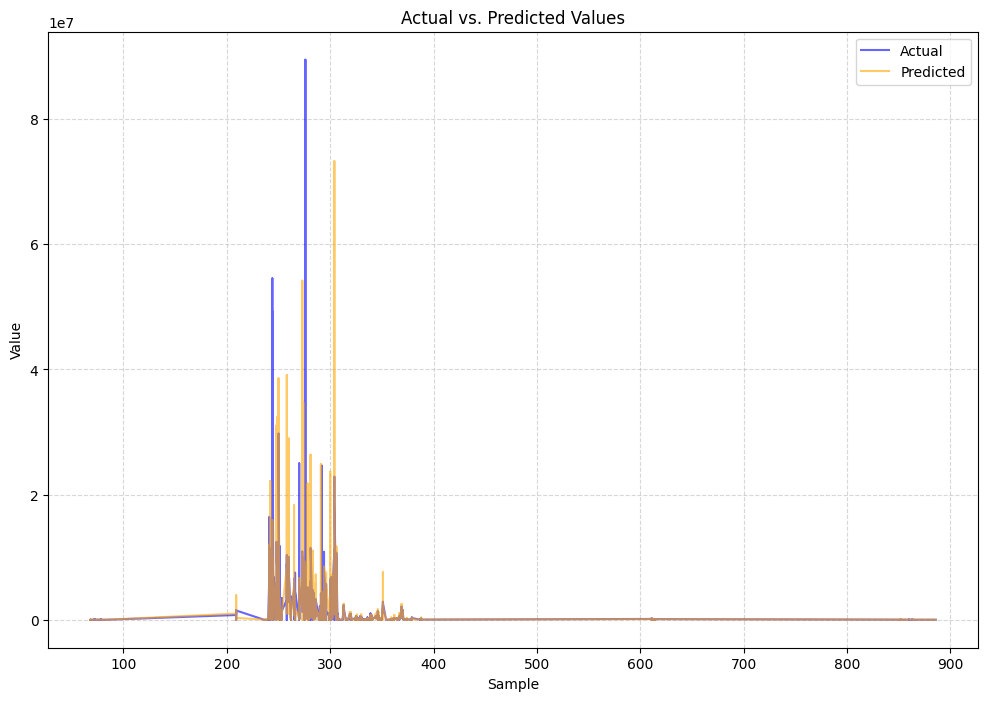

# Overview

This project aims to assess the impact of weather data on predicting building energy consumption. Specifically, it aims to demonstrate that incorporating weather information can improve prediction accuracy compared to models without this data.

# Exploratory Data Analysis

For more detailed insights, please refer to `notebooks/exploratory-data-analysis`.

# Scope

### 1. Focus on "Education" and "Office" Buildings

These two types of buildings (based on primary usage) represent over 50% of the total number of buildings, with a total of 924 buildings belonging to these categories.


### 2. Analysis of "HotWater" Meter

Hot water energy consumption exhibits a strong negative correlation with air temperature, which provides a basis for analyzing temperature effects on energy use.


# Data Preprocessing

1. Aggregate meter readings by date.
2. Fill missing meter readings with zero.
3. Impute missing weather data (air temperature).
4. Split the dataset into:
   - **Training Set** (Baseline Period - 2016)
   - **Testing Set** (Reporting Period - 2017)

# Model Selection

The LightGBM model is used for training and evaluation.

# Hyperparameter Tuning

Optuna is employed to search for the optimal hyperparameters.

# Final Hyperparameters Used for Reporting

The selected parameters for model reporting are as follows:

```json
best_params = {
    "num_leaves": 1000,
    "learning_rate": 0.01,
    "max_bin": 512,
    "lambda_l1": 0.01,
    "lambda_l2": 0.01,
    "min_child_samples": 20,
    "max_depth": 15
}
```

# Results on Baseline Period (2016 - Training Set)

## 1. Model with Weather Data (Air Temperature)

Results for hot water meter on the training set:
- **RMSE**: 1,233,215.68
- **CV-RMSE**: 129.12%
- **NMBE**: 9.55%
- **MBE**: 91,198.87
- **R²**: 0.71


## 2. Model without Weather Data

Results for hot water meter on the training set:
- **RMSE**: 1,161,511.90
- **CV-RMSE**: 121.61%
- **NMBE**: 15.06%
- **MBE**: 143,836.42
- **R²**: 0.7428


## 3. Observations

Including weather data (air temperature) in training resulted in a lower NMBE, indicating improved accuracy in the model’s predictions. However, other metrics, including RMSE and R², show minimal change between the models with and without weather data.

# Results on Reporting Period (2017 - Test Set)

## 1. Model with Weather Data (Air Temperature)

Results for hot water meter on the test set:
- **RMSE**: 2,255,618.22
- **CV-RMSE**: 235.73%
- **NMBE**: 11.13%
- **MBE**: 106,541.90
- **R²**: 0.2719



## 2. Model without Weather Data

Results for hot water meter on the test set:
- **RMSE**: 2,104,897.29
- **CV-RMSE**: 220.38%
- **NMBE**: 15.15%
- **MBE**: 144,733.81
- **R²**: 0.3649


## 3. Observations

For the test set, the model trained without weather data showed a slightly lower RMSE and higher R² than the model trained with weather data, indicating a marginally better fit. However, the model with weather data had a significantly lower NMBE, suggesting that weather data contributes to reducing systematic bias in energy consumption predictions.


